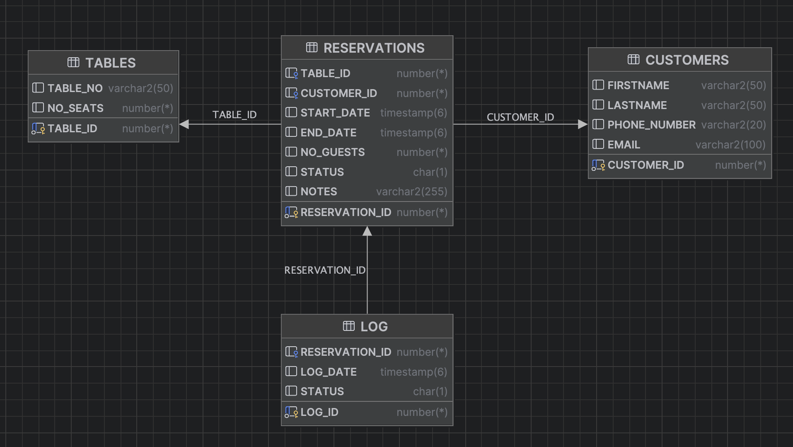

Iga Antonik, Antoni Smółka

SZBD - Oracle, Backend - Fast API, Frontend - React 
To build an app run "docker-compose up"

# reservation_app
 The "reservation_app" is designed for a single restaurant, enabling patrons to effortlessly book tables through an online platform while providing real-time information on table availability. It serves as an all-in-one reservation management and table optimization tool for the restaurant's staff.

## Tables
### Tables: 
A table storing information about tables in a restaurant, containing fields such as:
- table_id - Table ID
- table_no - Table number 
- no_seats - Number of seats

### Reservations: 
A table storing information about table reservations, containing fields such as:
- reservation_id - reservation ID
- table_id - table ID
- customer_id - customer ID
- start_date - date, time the reservation duration starts
- end_date - date, time when reservation duration ends
- no_guests - Number of persons
- status - Booking status
  - N - new
  - P - confirmed
  - C - cancelled
- notes - Additional notes

### Customers: 
A table storing information about customers who make bookings, containing fields such as:
- customer_id - Customer ID
- firstname - Firstname 
- lastname - Lastname
- phone_number -Phone number
- email - Email address

### Log:
Table storing the log of reservation status changes 
- log_id - identifier, primary key
- reservation_id - reservation identifier
- log_date - date of change
- status - status

## System functions:

### Customers can:
- register a new account in the system;     		???
- update their account information;  		???
- reserve a table for a selected date and time;
- cancel their reservation;
- view a list of available tables for a selected date and time;
- view a list of statuses of tables for a selected day;
- view a list of their current and past reservations;
- view details of their reservation, such as date, time, number of guests, status.

### Restaurant Staff can:
- view a list of all reservations;
- view a list of reservations for selected date and time;
- view a list of available tables for a selected date and time;
- view the history of reservation status changes;
- view details of selected reservation, such as date, time, number of guests, status.
- change a table reservation status.

### Administrator can:
- add a new table to the system;
- edit an existing table in the system;
- delete a table from the system;
- change reservation status;
- view a list of all reservations;
- view a list of reservations for selected date and time;
- view a list of available tables for a selected date and time;
- view the history of reservation status changes;
- view details of selected reservation, such as date, time, number of guests, status.

## Views
Reservations View:  
vw_all_eservations - Presents all reservations information.

Current number of Customers View:  
vv_current_customers_no - how many guests are currently in the restaurant.

## Functions
Table Availability within Certain Hours:  
f_table_availability_hours - displays available tables for a selected date and time. 
function parameters: start_date, end_date

Table Availability on Certain Day:  
f_table_availability_day - displays statuses of tables for a selected day. 
function parameters: date

Customer Reservation History:  
f_reservation_history - shows past and current reservations for a specific customer. 
function parameters: customer_id

Reservations within Certain Hours:  
f_reservations_hours - displays reservations for a selected date and time. 
function parameters: start_date, end_date

Reservations on Certain Day:  
f_reservations_day - displays reservations for a selected day. 
function parameters: date

Reservation Details:  
vw_reservation - Presents all reservation information. 
function parameters: reservation_id

Reservation Status History View: ???  
Provides a history of reservation status changes.

## Procedures
Add New Table:  
p_add_table - Adds a new table to the system. 
procedure parameters: table_no, no_seats

Edit Existing Table:  
p_edit_table - Edits the details of an existing table in the system, change number of seats 
procedure parameters: table_id, new_seats_no

Delete Table:  
 p_delete_table - Deletes a table from the system. 
procedure parameters: table_id

Add Reservation:  
p_add_reservation - Adds new reservation 
procedure parameters: table_id, customer_id, date_start, date_end, no_guests (optional, default no_guest = table.no_seats), notes (optional)

Cancel Reservation:  
p_change_reservation_status - Updates the status of a reservation to canceled(C). 
procedure parameters: reservation_id

Confirm Reservation:  
p_confirm_reservation - Updates the status of a reservation to confirmed (P). 
procedure parameters: reservation_id

Change Reservation Status to New: ???  
p_confirm_reservation - Updates the status of a reservation to New (N). 
procedure parameters: reservation_id

Check customer exist: 
p_customer_exist - checks if customer with the given id exists 
procedure parameters: customer_id

Check table exist: 
p_table_exist - checks if table with the given id exists 
procedure parameters: table_id

Check reservation exist: 
p_reservation_exist - checks if reservation with the given id exists 
procedure parameters: reservation_id

## Triggers
Delete Reservation: 
trg_delete_reservation - Does not allow to delete reservation

Add Reservation 
trg_before_insert_reservation - checks if a reservation can be made.

Change Reservation Status: 
trg_before_update_reservation_status - checks if a reservation status can be changed.

Add log when adding new reservation: 
trg_log_adde_reservation -  Adds log to the created reservation (status new).

Add log when changing reservation status: 
trg_log_change_reservation_status - Adds log of reservation changed status.

