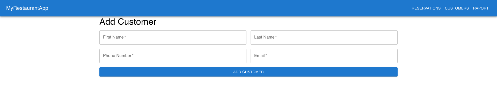

# Reservation App
Iga Antonik, Antoni Smółka

## Introduction
 The "**reservation_app**" is designed for a single restaurant, enabling waitresses to effortlessly book tables through a platform while providing real-time information on table availability. It serves as an all-in-one reservation management and table optimization tool for the restaurant's staff.

 ## Technologies used in the project
- SZBD - Oracle,
- Backend - Fast API, 
- Frontend - React 

## Database schema
 

## System functionalities
- New customer registration
- Booking a table
- Change of reservation status
- Overview of available tables
- Overview of all reservations
- Overview of today's reservation
- View a specific customer's reservation
- View monthly table consumption report


## Database and backend communication
The backend communicates with the Oracle database using the cx_Oracle library.

 ``` py
 @contextmanager
def get_db_connection():
    connection = cx_Oracle.connect(user=username, password=password, dsn=dsn, encoding="UTF-8")
    try:
        yield connection
    finally:
        connection.close()

```

## Booking a table
To make a reservation, a restaurant employee has to go through several screens on the website, such as selecting customer, start date and time, number of guests, duration of the reservation and type of table at which customer wishes to sit. If it is the first time a guest has made a reservation in the restaurant, at the initial stage they are redirected to the panel for adding a new customer. 

 


The display of the entire form is implemented here: [making reservation frontend](frontend/src/components/MakeReservation.jsx)

The assigned endpoint collects data from the frontend and passes it to the procedure. Then it returns information about the success of the operation. 

``` py
@app.post("/add_reservation")
def add_reservation(reservation: Reservation):
    sql = """
    BEGIN
        p_add_reservation(
            p_table_id => :table_id,
            p_customer_id => :customer_id,
            p_date_start => :start_date,
            p_date_end => :end_date,
            p_no_guests => :no_guests,
            p_notes => :notes
        );
    END;
    """
    try:
        with get_db_connection() as connection:
            cursor = connection.cursor()
            cursor.callproc('DBMS_OUTPUT.ENABLE', (None,))
            cursor.execute(sql, reservation.dict())

            messages = []
            status_var = cursor.var(int)
            line_var = cursor.var(str)
            while True:
                cursor.callproc('DBMS_OUTPUT.GET_LINE', (line_var, status_var))
                if status_var.getvalue() != 0:
                    break
                messages.append(line_var.getvalue())

            connection.commit()
            return {"message": messages}
    except Exception as e:
        connection.rollback()
        raise HTTPException(status_code=status.HTTP_500_INTERNAL_SERVER_ERROR, detail=str(e))

```

In order to ensure the security of the reservation procedure, additional procedures have been used to check whether the specified customer and table exist in the database. Before adding a reservation to the database, the corresponding trigger checks whether it collides with any already existing reservation. Another trigger adds log to the table.


``` sql
create PROCEDURE p_add_reservation (
    p_table_id IN RESERVATIONS.TABLE_ID%TYPE,
    p_customer_id IN RESERVATIONS.CUSTOMER_ID%TYPE,
    p_date_start IN date,
    p_date_end IN date,
    p_no_guests IN RESERVATIONS.NO_GUESTS%TYPE,
    p_notes IN RESERVATIONS.NOTES%TYPE
) AS
    p_status char;
    v_seats_no int;
BEGIN
    P_TABLE_EXIST(p_table_id);
    P_CUSTOMER_EXIST(p_customer_id);

    SELECT NO_SEATS INTO v_seats_no FROM TABLES WHERE TABLE_ID = p_table_id;

    if p_no_guests > v_seats_no then
        raise_application_error(-20001, 'Too much guests for this table');
    end if;
    if p_date_start <= CURRENT_DATE then
        raise_application_error(-20001, 'Choose future date');
    end if;

    if p_date_start > CURRENT_DATE and p_no_guests <= v_seats_no then
            p_status := 'N';
            INSERT INTO RESERVATIONS (TABLE_ID, CUSTOMER_ID, START_DATE, END_DATE, NO_GUESTS,STATUS, NOTES)
            VALUES (p_table_id, p_customer_id, p_date_start, p_date_end, p_no_guests, p_status, p_notes);
    end if;
    
    COMMIT;
    DBMS_OUTPUT.PUT_LINE('Reservation added successfully.');
EXCEPTION
    WHEN OTHERS THEN
        ROLLBACK;
        DBMS_OUTPUT.PUT_LINE('Error: Unable to add reservation.');

END p_add_reservation;
/
```

When making reservations, other endpoints and corresponding functions in the database are also used. To display all customers we use ```@app.get(“/customers”)```.

To display available table types we use ```@app.get(“/available_tables”)``` and the ```f_tables_availability_hours``` function.

At the end of the process we want to pass to the procedure that reserves the table the first available ID of the table that meets all the previously selected criteria. For this purpose, we have created endpoint ```@app.get(“/choosen_table_id”)```, which references function ```f_get_first_available_table_by_type2```


## Displaying reservations
A restaurant employee can view all reservations or filter them and view reservations that will take place the current day. 


In addition, after clicking on “CUSTOMERS” and then on “VIEW RESERVATIONS” all reservations for the selected customer will be displayed.


The display of the reservations view is implemented here: [reservations frontend](frontend/src/components/Reservations.jsx)

To display all of the reservations we use endpoint```@app.get("/reservations")``` and ```vw_all_reservations``` view. 

Reservations that take place on the current day are displayed using the endpoint ```@app.get(“/today”)``` and the ```vw_today_reservations``` view

To see reservations for specific customer we use endpoint ```@app.get("/reservations/{customer_id})```. It takes the customer id from the link and calls function that displays the matching reservations.

``` py
@app.get("/reservations/{customer_id}")
def read_reservations(customer_id: int):
    try:
        with get_db_connection() as connection:
            with connection.cursor() as cursor:
                # Use the customer_id in your SQL function call
                cursor.execute(f"""
                    SELECT * FROM TABLE(F_CUSTOMER_RESERVATION_HISTORY(:customer_id))
                """, {'customer_id': customer_id})
                customers = cursor.fetchall()
                if not customers:
                    raise HTTPException(status_code=404, detail="No reservations found for this customer.")

                customers_list = [
                    {
                        "reservation_id": row[0],
                        "table_id": row[1],
                        "table_type": row[2],
                        "start_date": row[3],
                        "end_date": row[4],
                        "no_guests": row[5],
                        "status": row[6],
                        "notes": row[7]

                    } for row in customers
                ]
        return {"customers": customers_list}
    except Exception as e:
        raise HTTPException(status_code=500, detail=str(e))
```

Function ```f_customer_reservation_history``` with the help of procedure that checks whether specified customer exists, returns reservations of specific customer

``` sql
create function f_customer_reservation_history(customer_id int)
    return customer_reservation_info_table
as
    result customer_reservation_info_table;
begin
    p_customer_exist(customer_id);

    select customer_reservation_info(r.reservation_id, r.table_id, tt.type_name, r.start_date, r.end_date, r.no_guests, r.status, r.notes)
    bulk collect into result
    from reservations r
    join tables t on r.table_id = t.table_id
    join table_types tt on t.table_type_id = tt.type_id
    where r.customer_id = f_customer_reservation_history.customer_id;

    return result;
end;
```

 ## Changing reservation status
The application allows employees to change the status of a reservation. There are three options: 
 - N - a new reservation, 
 - P - the customer completed/showed up for the reservation,
 - C - the customer canceled the reservation. 
 
 The system allows to change the status from any to any, provided that the table has not already been booked by someone else. 

Buttons for status changing are implemented here: [reservations frontend](frontend/src/components/Reservations.jsx) in ```updateReservationStatus``` function.

The assigned endpoint ```@app.post("/update_reservation_status")``` collects data from the frontend, checks if they are correct and passes it to the procedure. Then it returns information about the success of the operation. 

``` py
class ReservationStatusUpdate(BaseModel):
    reservation_id: int
    new_status: str

@app.post("/update_reservation_status")
def update_reservation_status(update: ReservationStatusUpdate):
    valid_statuses = {'C', 'N', 'P'}  
    if update.new_status not in valid_statuses:
        raise HTTPException(status_code=status.HTTP_400_BAD_REQUEST, detail="Invalid status provided.")

    sql = """
    BEGIN
        p_modify_reservation_status(
            p_reservation_id => :reservation_id,
            p_new_status => :new_status
        );
    END;
    """
    try:
        with get_db_connection() as connection:
            cursor = connection.cursor()
            cursor.execute(sql, {
                'reservation_id': update.reservation_id,
                'new_status': update.new_status
            })
            connection.commit()
            return {"message": "Reservation status updated successfully"}
    except Exception as e:
        connection.rollback()
        raise HTTPException(status_code=status.HTTP_500_INTERNAL_SERVER_ERROR, detail=str(e))
```

The ```p_modify_reservation_status``` procedure checks if requested reservation exists and updates reservation status. Additional triggers on reservations table ( ```trg_before_change_reservation_status```, ```trg_log_change_reservation_status```) check if update can be done and add the new log to the table of logs.

``` sql
create PROCEDURE p_modify_reservation_status (p_reservation_id INT, p_new_status CHAR)
AS
    v_current_status char;
BEGIN
    P_RESERVATION_EXIST(p_reservation_id);
    
    select status into v_current_status
    from reservations
    where reservation_id = p_reservation_id;
    if v_current_status = p_new_status then
    raise_application_error(-20001, 'The reservation already has the requested status.');
    end if;

    if p_new_status = 'C' or p_new_status = 'N' or p_new_status = 'P' then
        UPDATE reservations
        SET status = p_new_status
        WHERE reservation_id = p_reservation_id;
    end if;
    COMMIT;
    EXCEPTION
    WHEN OTHERS THEN
        ROLLBACK;
        RAISE;

END;
/
```


 ## Adding and displaying customers
 Application allows to see all of the restaurants customers and also filter them by phone number. The phone number is treated as unique in the database and the database does not allow adding two customers with the same phone number.

 


To add a new customer restaurant employee has to fill out one form with data of the customer.



All these functionalities are implemented here: [customers frontend](frontend/src/components/Customers.jsx), [adding new customer frontend](frontend/src/components/AddCustomer.jsx)

On the backend we used endpoints ```@app.get("/customers")``` and ```@app.post("/add_customer")``` which reference to database procedure ```p_add_customer```.

 ## Raport

The ```view_table_utilization``` view provides a comprehensive report on the utilization of tables in a restaurant or similar setting. This view is designed to help management understand how effectively each table is being used, which can inform decisions about table allocation, capacity planning, and overall space management. The utilization percentage is calculated based on the assumption that each table is available for 480 minutes per day (8 hours) over a 30-day month.


```sql
create view VIEW_TABLE_UTILIZATION as
WITH ReservationDuration AS (
    SELECT
        TABLE_ID,
        SUM(EXTRACT(HOUR FROM (END_DATE - START_DATE)) * 60 + EXTRACT(MINUTE FROM (END_DATE - START_DATE))) AS total_minutes_reserved
    FROM
        RESERVATIONS
    GROUP BY
        TABLE_ID
)
SELECT
    T.TABLE_ID,
    T.NO_SEATS,
    TT.TYPE_NAME,
    NVL(RD.total_minutes_reserved, 0) AS total_minutes_reserved,
    ROUND((NVL(RD.total_minutes_reserved, 0) / (480 * 30)) * 100, 2) AS utilization_percentage -- assuming a 30-day month
FROM
    TABLES T
JOIN
    TABLE_TYPES TT ON T.TABLE_TYPE_ID = TT.TYPE_ID
LEFT JOIN
    ReservationDuration RD ON T.TABLE_ID = RD.TABLE_ID
ORDER BY
    utilization_percentage DESC

```


## Security

The system does not allow any data to be deleted from the database. There are also implemented triggers which check whether certain data can be added to the database. A check constraint has also been added to the phone_number field to ensure that it is unique and contains 9 digits


## Code


[whole frontend](frontend/src/components)

[whole backend](backend/main.py)

[database](database/database.sql)

## How to use
To build an app run: ```docker-compose up```
